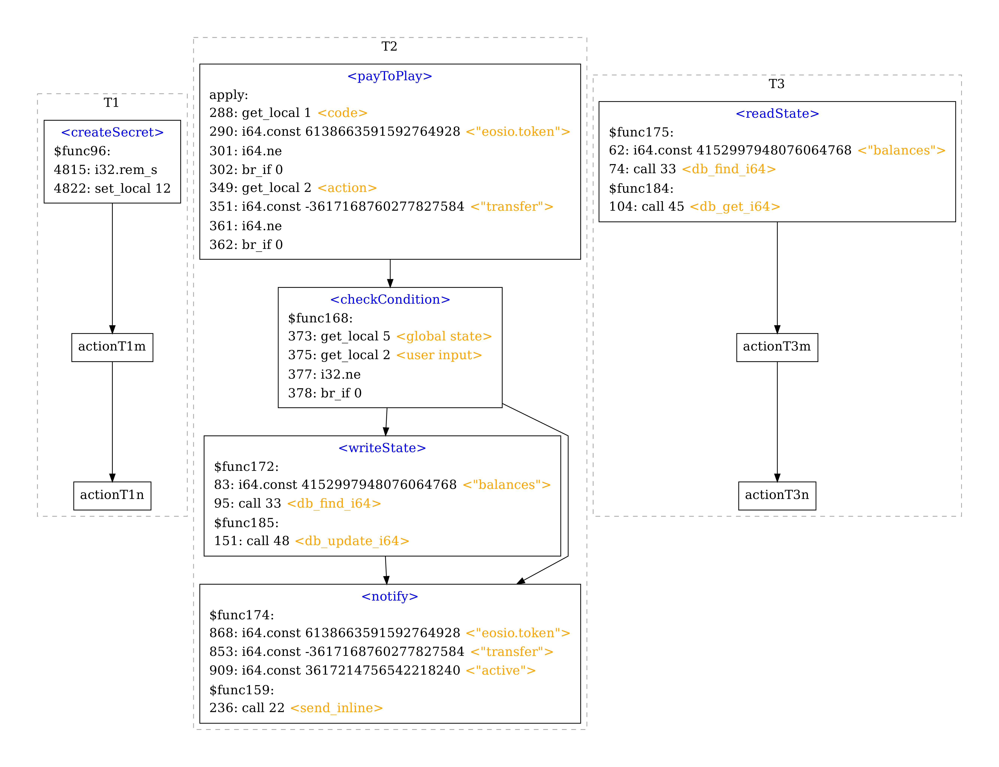

# VetEOS

VetEOS is a state-of-the-art static analysis framework for the “Groundhog Day” Vulnerabilities (GDVs) in EOSIO smart contracts.

Paper: _VETEOS: Statically Vetting EOSIO Contracts for the “Groundhog Day” Vulnerabilities_.

## Groundhog Day Vulnerability

In a Groundhog Day attack, adversaries can exploit the unique rollback problem in EOSIO contracts to retry executing the same contract code repeatedly with different inputs. With leaked information observed during previous executions, attackers illegally accumulate knowledge about the victim contract, so as to learn how to make illicit profits in a deterministic manner. We detect GDVs based on the following 4 key factors.

### Four key factors:

- **(_F1_) Revertable:** A sequence of activities locate in a single transaction that can be reverted entirely, so that a malicious user can rerun it _unlimitedly_ for free.
- **(_F2_) Unpredictably profitable:** Whether one can make profits legally from a vulnerable contract is unpredictable. It relies on a _secret_ condition the contract uses to evaluate participants’ inputs.
- **(_F3_) Information leakage:** A state is changed in the middle of the revertable transaction. The state change is _visible_ outside this transaction.
- **(_F4_) Causal inference:** The change to the visible state is caused by the invisible comparison between a user _input_ and the secret, and therefore can be used to infer the comparison result.

## Environment and Dependencies

### Environment

- Ubuntu >= 16.04
- Python 3.7 or 3.8

### Dependencies

- wasm
- graphviz
- timeout-decorator

## Usage

### Download VetEOS

```bash
git clone https://github.com/HKJL10201/VetEOS.git
```

### Install Dependencies

```bash
python3 install_dependencies.py
```

Note: the script `install_dependencies.py` uses `pip` to install `graphviz`, if `pip` fails, please try `apt-get`:

```bash
sudo apt-get install graphviz
```

### Detect GDV

```bash
python3 main.py -f <filepath> -g -d
```

Example:

```bash
python3 main.py -f samples/30758713_14_0.wasm -g -d
```

### Run VetEOS Terminal (WIP)

```bash
python3 main.py -v
```

Commands:

- `load <file path>`: load `.wasm` file.
- `f <function name>`: initialize a function.
- `i <instruction offset>`: tag an instruction, the offset can be either decimal or hexadecimal (starting with `0x`).
- `n`: jump to the next instruction.
- `p`: jump to the previous instruction.
- `fi`: print all instructions in the function.
- `acg`: print the action call graph.
- `dfg`: generate the dataflow graph of the function.
- `q`: exit the VetEOS terminal.

## Run Test

### Basic Test

```bash
python3 tests/test_dependencies.py
```

Expected Results:

```
wasm test passed.
graphviz test passed.
timeout_decorator test passed.
All dependency tests passed.
```

### GDV Detection Test

#### GDV Detection and Analysis Graph Generation Test

```bash
bash tests/test_GDV.sh
```

Expected Results:

```
Analyzing file: samples/127922358_8_0.wasm (1/24)
Analyzing file: samples/127926023_31_0.wasm (2/24)
...
Analyzing file: samples/76382615_19_0.wasm (23/24)
Analyzing file: samples/88160916_2_0.wasm (24/24)
Total number of files analyzed: 24
Detected Groundhog Day Vulnerabilities: 24
Results are stored in ./results/
```

- The logs and generated analysis summary graphs will be stored in `./results/`.

- Example of analysis log: [./results/example.log](./results/example.log)

- Example of analysis summary graph: [./results/example.pdf](./results/example.pdf)

  

#### Large-scale GDV Detection Test

Run VetEOS on 735 samples, which will take a relatively long time.

```bash
bash tests/test_GDV_all.sh
```

Expected Results:

```
Analyzing file: samples/all/110070118_1_0.wasm (1/735)
Analyzing file: samples/all/110292478_17_0.wasm (2/735)
...
Analyzing file: samples/all/98838110_6_0.wasm (734/735)
Analyzing file: samples/all/99649914_8_0.wasm (735/735)
Total number of files analyzed: 735
Detected Groundhog Day Vulnerabilities: 735
```

If need to dump the log files to `./results/`, modify the line 17 of `./tests/test_GDV_all.sh` to be `output=$(python3 main.py -f "$file" -g -d)`.

### Dataflow Analysis Test

```bash
bash tests/test_dataflow.sh
```

Expected Results:

- You will see a process of automatic dataflow tracking testing through the VetEOS terminal.
- Example output: [./results/example_output_dataflow_test.log](./results/example_output_dataflow_test.log)

### Analysis Accuracy Test

Note that accuracy tests requires manual verification against the source code, this test only automatically generates logs. The source code of the tested samples can be found in `./samples/sourcecode.tar.gz`.

#### Entry Point Detection Test

```bash
python3 tests/tests.py entrypoint
```

Expected Results:

```
...
>>>results:
samples:98
error:0
```

#### Dataflow Accuracy Test

```bash
python3 tests/tests.py dataflow
```

Expected Results:

```
...
>>>results:
dataflow false positive test:
test cases:537
error:0
dataflow false negative test:
test cases:537
error:0
```

## Architecture

```
|-- results/                        test results and example outputs
|-- samples/                        vulerable contract samples
| |-- allvulnerable.tar.gz          735 vulerable samples
| |-- opensource.tar.gz             98 open-source vulerable samples
| |-- sourcecode.tar.gz             source code of the 98 open-source samples
|-- tests/                          test scripts
| |-- commands.txt                  commands for VetEOS Terminal Test
| |-- test_dataflow.sh              cript for Dataflow Analysis Test
| |-- test_dependencies.py          script for Dependency Test
| |-- test_GDV_all.sh               script for Large-scale GDV Detection Test
| |-- test_GDV.sh                   script for GDV Detection Test
| |-- tests.py                      script for Analysis Accuracy Test
|-- veteos/                         core code of VetEOS
| |-- octopus/                      Octopus libraries
| |-- analyses.py                   secondary analysis algorithms
| |-- analyzer.py                   Analyzer class for GDV analysis
| |-- contract.py                   Contract class for contract initialization
| |-- core.py                       core analysis algorithms
| |-- function.py                   VetFunction class for function initialization
| |-- instruction.py                VetInstruction class for instruction initialization
| |-- misc.py                       other functions and constants
| |-- node.py                       Node class for building Tree structures
| |-- solver.py                     Solver class for GDV detection
| |-- ssa.py                        SSAnode class for SSA data structure
| |-- terminal.py                   Terminal class for VetEOS Terminal
| |-- utils.py                      utility functions
|-- install_dependencies.py         script for installing dependencies
|-- main.py                         main interface of VetEOS
|-- requirements.txt                the names of dependencies
```
